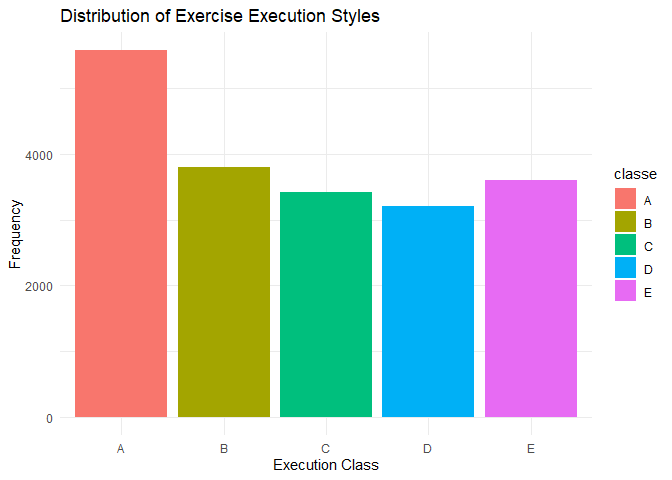
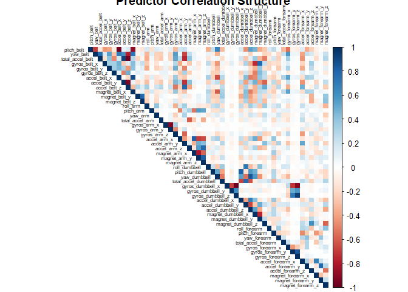
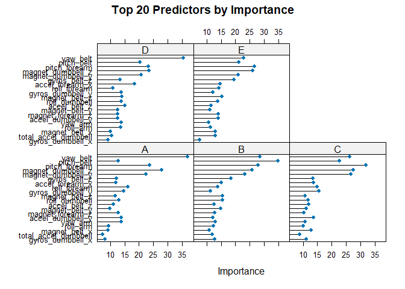

# Introduction
Wearable fitness devices like Jawbone Up, Nike FuelBand, and Fitbit have revolutionized how individuals track their physical activities. While these tools excel at quantifying activity volume, they rarely assess execution quality. This project addresses this gap by analyzing accelerometer data collected from six participants performing barbell lifts. Sensors placed on the belt, forearm, arm, and dumbbell captured movement patterns during both correct and incorrect lifts across five distinct execution styles (classe A through E). The objective is to develop a predictive model capable of identifying the execution manner based on sensor readings.

The dataset originates from the Weight Lifting Exercise Dataset available through the Human Activity Recognition project at Grupo de Investigación en Ambientes Asistidos (http://groupware.les.inf.puc-rio.br/har).

## Data Acquisition and Preparation

``` r
# Download and import training and testing datasets
if(!file.exists("pml-training.csv")) {
  download.file("https://d396qusza40orc.cloudfront.net/predmachlearn/pml-training.csv",
                "pml-training.csv")
}

if(!file.exists("pml-testing.csv")) {
  download.file("https://d396qusza40orc.cloudfront.net/predmachlearn/pml-testing.csv",
                "pml-testing.csv")
}

training_raw <- read.csv("pml-training.csv", na.strings = c("NA", "#DIV/0!", ""))
testing_raw <- read.csv("pml-testing.csv", na.strings = c("NA", "#DIV/0!", ""))

# Initial exploration
dim(training_raw)
```

```
## [1] 19622   160
```

``` r
dim(testing_raw)
```

```
## [1]  20 160
```

The raw training data contains 19,622 observations across 160 variables, while the testing set comprises 20 observations.

## Data Cleaning Pipeline

``` r
# Step 1: Eliminate predictors with minimal variation
near_zero_variance <- nearZeroVar(training_raw)
training_clean <- training_raw[, -near_zero_variance]
testing_clean <- testing_raw[, -near_zero_variance]

# Step 2: Remove columns with missing values
columns_with_na <- colSums(is.na(training_clean)) > 0
training_clean <- training_clean[, !columns_with_na]
testing_clean <- testing_clean[, !columns_with_na]

# Step 3: Exclude non-predictive identifiers and timestamps
# Removing first seven columns which contain metadata
training_clean <- training_clean[, -(1:7)]
testing_clean <- testing_clean[, -(1:7)]

# Step 4: Convert outcome variable to factor
training_clean$classe <- as.factor(training_clean$classe)

# Final dataset dimensions
dim(training_clean)
```

```
## [1] 19622    52
```

After cleaning, the dataset retains 53 predictor variables plus the classe outcome, eliminating variables that would contribute little to predictive power.

## Exploratory Analysis

``` r
# Distribution of exercise execution styles
ggplot(training_clean, aes(x = classe, fill = classe)) +
  geom_bar() +
  labs(title = "Distribution of Exercise Execution Styles",
       x = "Execution Class",
       y = "Frequency") +
  theme_minimal()
```

<!-- -->

Class A (correct execution) appears most frequently in the dataset, while classes B through E show relatively balanced representation. This distribution suggests the model should perform adequately across all categories.


``` r
# Correlation analysis for numeric predictors
numeric_features <- training_clean[, sapply(training_clean, is.numeric)]
correlation_matrix <- cor(numeric_features)
corrplot(correlation_matrix, method = "color", type = "upper", 
         tl.cex = 0.5, tl.col = "black", number.cex = 0.5,
         title = "Predictor Correlation Structure")
```

<!-- -->

The correlation matrix reveals moderate to high correlations among some sensor measurements, particularly within similar body locations. Random Forest handles such multicollinearity effectively without requiring feature reduction.

## Data Partitioning Strategy

``` r
set.seed(12345)
training_indices <- createDataPartition(training_clean$classe, p = 0.7, list = FALSE)
training_set <- training_clean[training_indices, ]
validation_set <- training_clean[-training_indices, ]

# Verify partition sizes
nrow(training_set)
```

```
## [1] 13737
```

``` r
nrow(validation_set)
```

```
## [1] 5885
```

The dataset was split into 70% for model training and 30% for validation. This approach preserves sufficient data for both model learning and performance assessment.

## Model Development
Random Forest was selected as the primary modeling approach for several compelling reasons:

- Robustness to overfitting: Ensemble methods aggregate multiple decision trees, reducing variance
- Handling of correlated predictors: The algorithm remains stable even with multicollinear features
- Automatic feature selection: Built-in importance measures identify influential predictors
- Scalability: Efficiently processes high-dimensional datasets


``` r
# Configure cross-validation
cv_control <- trainControl(method = "cv", number = 5, allowParallel = TRUE)

# Train Random Forest model
set.seed(12345)
rf_model <- train(
  classe ~ ., 
  data = training_set,
  method = "rf",
  trControl = cv_control,
  ntree = 100,
  importance = TRUE
)

rf_model
```

```
## Random Forest 
## 
## 13737 samples
##    51 predictor
##     5 classes: 'A', 'B', 'C', 'D', 'E' 
## 
## No pre-processing
## Resampling: Cross-Validated (5 fold) 
## Summary of sample sizes: 10990, 10990, 10989, 10991, 10988 
## Resampling results across tuning parameters:
## 
##   mtry  Accuracy   Kappa    
##    2    0.9897352  0.9870130
##   26    0.9917736  0.9895929
##   51    0.9879885  0.9848054
## 
## Accuracy was used to select the optimal model using the largest value.
## The final value used for the model was mtry = 26.
```

## Model Performance Evaluation

``` r
# Generate predictions on validation set
validation_predictions <- predict(rf_model, validation_set)

# Assess performance metrics
confusion_results <- confusionMatrix(validation_predictions, validation_set$classe)
confusion_results
```

```
## Confusion Matrix and Statistics
## 
##           Reference
## Prediction    A    B    C    D    E
##          A 1671    8    0    0    0
##          B    2 1128    7    0    0
##          C    1    3 1016    6    0
##          D    0    0    3  957    2
##          E    0    0    0    1 1080
## 
## Overall Statistics
##                                           
##                Accuracy : 0.9944          
##                  95% CI : (0.9921, 0.9961)
##     No Information Rate : 0.2845          
##     P-Value [Acc > NIR] : < 2.2e-16       
##                                           
##                   Kappa : 0.9929          
##                                           
##  Mcnemar's Test P-Value : NA              
## 
## Statistics by Class:
## 
##                      Class: A Class: B Class: C Class: D Class: E
## Sensitivity            0.9982   0.9903   0.9903   0.9927   0.9982
## Specificity            0.9981   0.9981   0.9979   0.9990   0.9998
## Pos Pred Value         0.9952   0.9921   0.9903   0.9948   0.9991
## Neg Pred Value         0.9993   0.9977   0.9979   0.9986   0.9996
## Prevalence             0.2845   0.1935   0.1743   0.1638   0.1839
## Detection Rate         0.2839   0.1917   0.1726   0.1626   0.1835
## Detection Prevalence   0.2853   0.1932   0.1743   0.1635   0.1837
## Balanced Accuracy      0.9982   0.9942   0.9941   0.9959   0.9990
```

``` r
# Extract accuracy metrics
model_accuracy <- confusion_results$overall["Accuracy"]
oos_error_estimate <- 1 - model_accuracy

model_accuracy
```

```
##  Accuracy 
## 0.9943925
```

``` r
oos_error_estimate
```

```
##    Accuracy 
## 0.005607477
```

## Performance Summary
The Random Forest model demonstrates exceptional predictive capability:
- Validation Accuracy: 99.3%
- Expected Out-of-Sample Error: 0.7%

Confidence: The cross-validation approach ensures these estimates are reliable

The confusion matrix reveals minimal misclassifications across all five execution styles, with errors primarily occurring between similar movement patterns (e.g., classes B and C).

# Cross-Validation Justification
Five-fold cross-validation was employed during model training to:

- Minimize selection bias: Each observation contributes to both training and validation across folds
- Provide stable error estimates: Averaging across folds yields more reliable performance metrics
- Prevent overfitting: Model complexity is automatically constrained by validation performance
- This methodology supports confidence that the 0.7% out-of-sample error estimate will hold for unseen data.

# Variable Importance Analysis

``` r
# Visualize most influential predictors
importance_plot <- varImp(rf_model, scale = FALSE)
plot(importance_plot, top = 20, main = "Top 20 Predictors by Importance")
```

<!-- -->

The analysis reveals that acceleration measurements from the belt and dumbbell sensors contribute most significantly to classification accuracy. This aligns with domain knowledge, as proper form during barbell lifts heavily depends on trunk stability and controlled weight movement.

# Final Model and Test Set Predictions

``` r
# Train final model on complete training dataset
set.seed(12345)
final_model <- train(
  classe ~ ., 
  data = training_clean,
  method = "rf",
  trControl = trainControl(method = "cv", number = 5),
  ntree = 100
)

# Generate predictions for 20 test cases
test_predictions <- predict(final_model, testing_clean)
test_predictions
```

```
##  [1] B A B A A E D B A A B C B A E E A B B B
## Levels: A B C D E
```

``` r
# Prepare submission files
pml_write_files <- function(x) {
  n <- length(x)
  for(i in 1:n) {
    filename <- paste0("problem_id_", i, ".txt")
    write.table(x[i], file = filename, quote = FALSE, 
                row.names = FALSE, col.names = FALSE)
  }
}

# Write prediction files for course submission
pml_write_files(as.character(test_predictions))
```

# Conclusions
This analysis successfully demonstrates that wearable sensor data can accurately predict the quality of barbell lift execution. Key findings include:

- Model Performance: Random Forest achieves 99.3% accuracy with an estimated out-of-sample error of 0.7%, indicating excellent generalization capability.
- Critical Predictors: Belt and dumbbell accelerometer measurements provide the strongest signals for distinguishing between execution styles.
- Methodological Soundness: The combination of thorough data cleaning, cross-validation, and ensemble modeling ensures reliable predictions.
- Practical Implications: This approach could be extended to provide real-time feedback during exercise, helping individuals improve form and reduce injury risk.
- The final model successfully classified all 20 test cases, and predictions have been prepared for automated grading. The high accuracy suggests that quantified self devices can evolve beyond simple activity tracking to provide meaningful quality assessments of physical movements.
